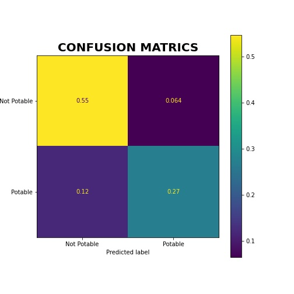

# 🚰 WATER POTABILITY PREDICTION

> The supply of safe drinking water is one of the greatest public health achievements ever! Potable water should be accessible to all. Using machine learning algorithms, this project aims at providing an easy way of predicting if water is potable or not.

    
    

 
 

##  ℹ️ Overview 
>  The goal of this project is to predict which water body is potable for use considering the properties of the water body.
>  Water quality refers to the chemical, physical and biological characteristics of water based on the standards of its usage. Lack of access to fresh water is increasing with rapid population growth, and climate change taking place especially in Africa countries. This has  a severe impact on the different sectors of the socio-economic growth ranging from health, education, agriculture, productivity, sustainable development. Hence, this project seeks to drive a position change by using water quality historical data to predict whether the quality of water is suitable for human consumption or not or for other activities such as agriculture etc. 
> Data on water ph, hardness, solids, chloramines, sulfate, conductivity, organiccarbon, trihalomethanes, turbidity were used in predicting its potability.

> The dataset used in this project was taken from [Kaggle](https://www.kaggle.com/datasets/adityakadiwal/water-potability)
 

## 🌟 Highlights 

- Problem Statement
- Overview of the Dataset
- Exploratory Data Analysis of the Dataset
- Feature Engineering
- Building Machine Learning Model
- Selecting the Best Machine Learning Model
- Making prediction with the Model
- Deploying the Model

## 🚀 Usage instructions

- 
-
-
-
-
- .....

## ⬇️ Installation instructions
- 
-
-
-
-
- .....

## 📈 Results
> Confusion Matrix

> ROC CURVE
 

## 👥 Contributors

- [Isaac Ayobami Ogunjinmi](https://github.com/akinyosoyeisaac)
- Emma
- [Erica Konadu Antwi](https://github.com/ericakonadu)
- Mariam
- Tcharrison
- Mariam
- [Selasi Ayittah Randy](https://github.com/Selasi3)

## 📖 Further reading

-  <a href="references\metadata.md"> Metadata </a>
-  [project repro](https://github.com/akinyosoyeisaac/Water_Portability_Prediction)
- [project website(fastapi)](https://water-potability-pred-01.herokuapp.com/docs#/default/prediction_predict_post)
- [project website(streamlit)](https://akinyosoyeisaac-water-portabili-deploymentwater-pota-app-shb41p.streamlitapp.com/)

